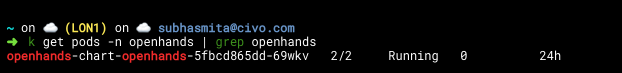
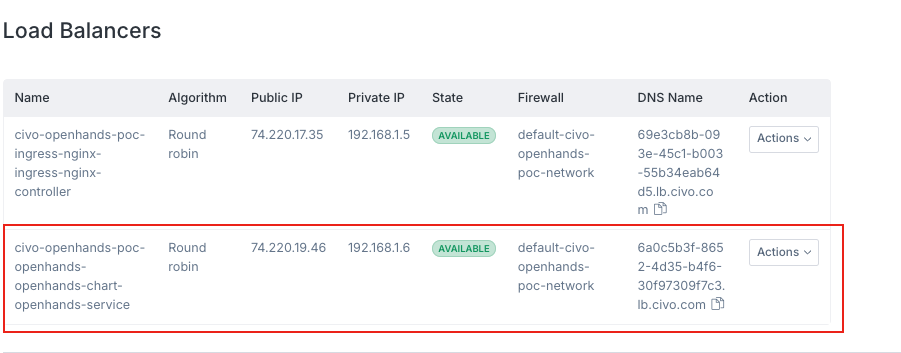
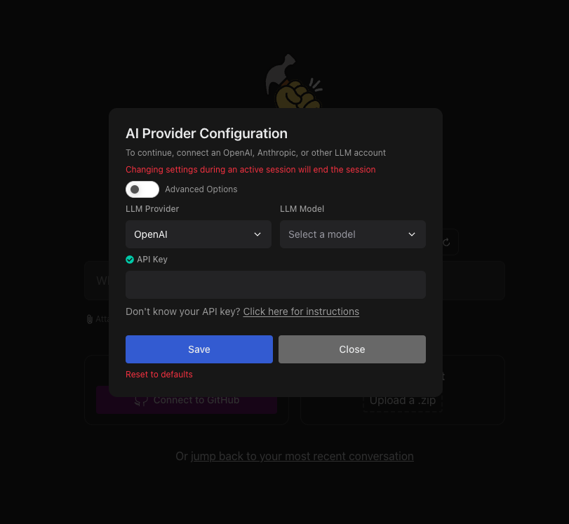
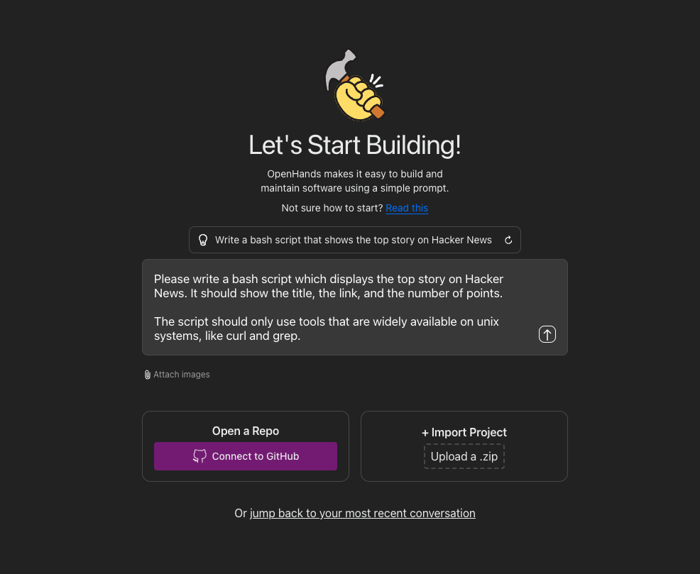

**OpenHands on Civo**
=====================================

**Table of Contents**
-----------------

* [Introduction](#introduction)
* [Getting Started](#getting-started)
* [Prerequisites](#prerequisites)
* [Setup on Civo](#setup-on-civo)
* [Project Configuration](#project-configuration)
* [Deployment Configuration](#deployment-configuration)
* [Commands to Setup the Application](#commands-to-deploy-the-application)
* [Customizable Steps in the Values](#customizable-steps-in-the-values)
* [Troubleshooting](#troubleshooting)
* [Contributing](#contributing)

**Introduction**
------------

[OpenHands](https://github.com/All-Hands-AI/OpenHands) OpenHands is an innovative open-source AI-powered software development agent created by All Hands AI. This tool is designed to autonomously tackle software development tasks, significantly enhancing productivity for developers. This project is designed to run OpenHands over a Kubernetes Cluster on [Civo Cloud](https://www.civo.com/) using Terraform. 

**Getting Started**
-----------------

### Prerequisites

* A [Civo Cloud account](https://dashboard.civo.com/).
* A [Civo Cloud API Key](https://dashboard.civo.com/security).
* Terraform installed on your machine.
* Helm installed on your machine

### Setup on Civo

1. Obtain your Civo API key from the Civo Cloud dashboard.

2. Create a file named terraform.tfvars in the project's root directory.

3. Insert your Civo API key into this file as follows:

```bash
civo_token = "YOUR_API_KEY"
```

**Project Configuration**
----------------------

Project configurations are managed within the `tf/variables.tf` file. This file contains definitions and default values for the Terraform variables used in the project.

| Variable             | Description                                       | Type   | Default Value      |
|----------------------|---------------------------------------------------|--------|--------------------|
| `cluster_name`       | The name of the cluster.                          | string | "civo-openhands"     |
| `cluster_node_size`  | The GPU node instance to use for the cluster.     | string | "g4c.kube.medium" |
| `cluster_node_count` | The number of nodes to provision in the cluster.  | number | 2                  |
| `civo_token`         | The Civo API token, set in terraform.tfvars.      | string | N/A                |
| `region`             | The Civo Region to deploy the cluster in.         | string | "LON1"             |

**Deployment Configuration**
-------------------------

| Key | Value | Description |
| --- | --- | --- |
| `replicaCount` | `1` | The number of replicas to run for the deployment |
| `image` | `docker.all-hands.dev/all-hands-ai/openhands:0.19` | The Docker image to use for the deployment |
| `SANDBOX_RUNTIME_CONTAINER_IMAGE` | `docker.all-hands.dev/all-hands-ai/runtime:0.19-nikolaik` | The default sandbox container runtime image for Openhands |

**Commands to Setup the Application**
--------------------------------------

Make sure you're in the correct directory `openhands-infra/tf/` before running the following set of commands: 

1.  **Initialize Terraform:**

    ```
    terraform init
    ```

    This command initializes Terraform, installs the required providers, and prepares the environment for deployment.

    *❗️Note: Be sure to replace the `civo_token` variable with your `Civo API Key` in the `terraform.tfvars` file*

2. **Plan Deployment:**

    ```
    terraform plan
    ```

    This command displays the deployment plan, showing what resources will be created or modified.

3. **Apply Deployment:**

    ```
    terraform apply
    ```

    This command applies the deployment plan. Terraform will prompt for confirmation before proceeding with the creation of resources.


Once all of the resources get created and the application has been deployed you should be able to see the application pod running in the  `openhands` namespace. 



After making sure the application pod is happy, you can access the Openhands application by following either choice of methods:

a. Service LoadBalancer External IP 

```bash
kubectl get svc -n openhands  
```

b. Port forward the application container 

```bash
kubectl port-forward <pod-name> <local-port>:3000
```

c. Access via civo loadbalancer dns from your civo dashboard




**Configuring Openhands**
--------------------------------------

1. Once you have access to the application you should be able to add your choice of LLM model along with the corresponding API Key. For more info on advanced configuration, refer the [openhands documentation](https://docs.all-hands.dev/modules/usage/how-to/gui-mode). 



2. Once you've connected your LLM, give it a prompt or connect it to your github repository and play around with it. 



**Customizable Steps in the Values**
--------------------------------------

The `values.yaml` file contains customizable settings for the OpenHands deployment. You can modify the values to suit your specific needs.

### Customizable Steps

| Key | Value | Description |
| --- | --- | --- |
| `openhands.config` | `{key: value}` | Custom configuration for OpenHands |
| `pvc.size` | `300Gi` | The size of the persistent volume claim |
| `service.type` | `LoadBalancer` | The type of service to expose |

To customize the values, modify the file `values.yaml` with the desired settings. 

**Troubleshooting**
-----------------

* If you encounter issues with the deployment, check the Helm logs by running the command `helm logs openhands`.
* If you encounter issues with the OpenHands application, check the container logs by running the command `kubectl logs <pod-name>`.

**Contributing**
--------------

To contribute to the OpenHands on Civo project, follow these steps:

1. Fork the repository to your own GitHub account.
2. Create a new branch for your feature or bug fix.
3. Make changes to the code and commit them to your branch.
4. Open a pull request to the main repository.
5. Wait for the pull request to be reviewed and merged.